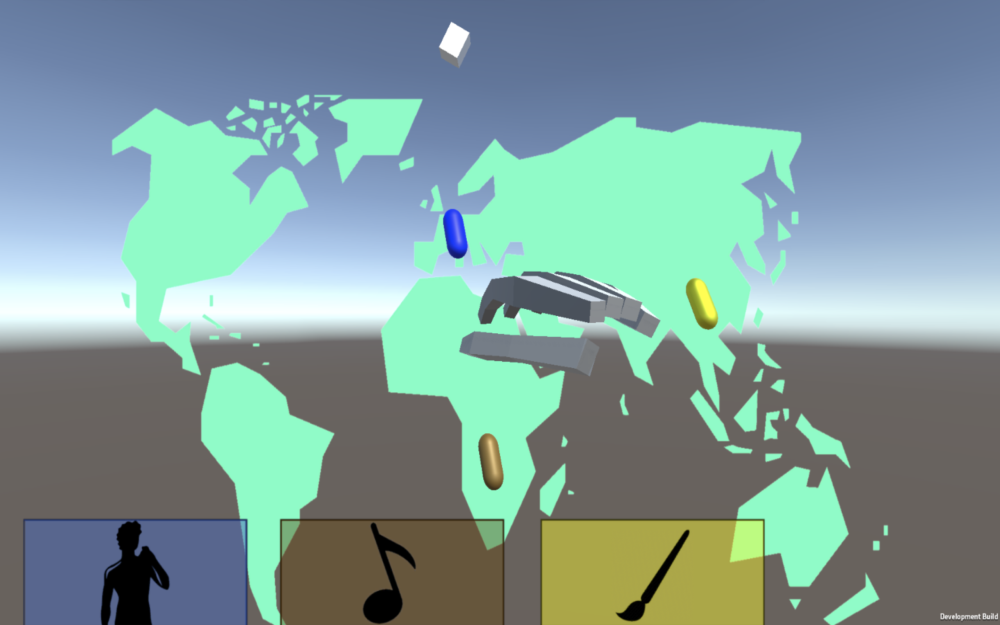
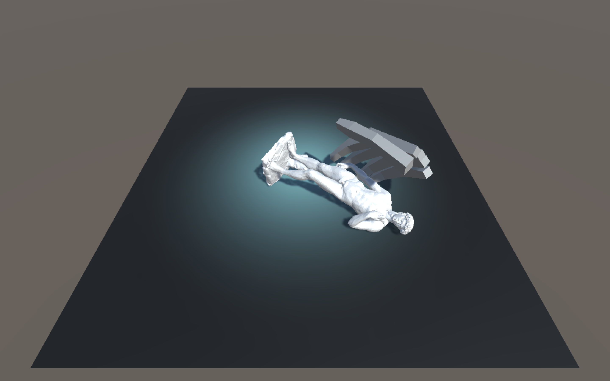
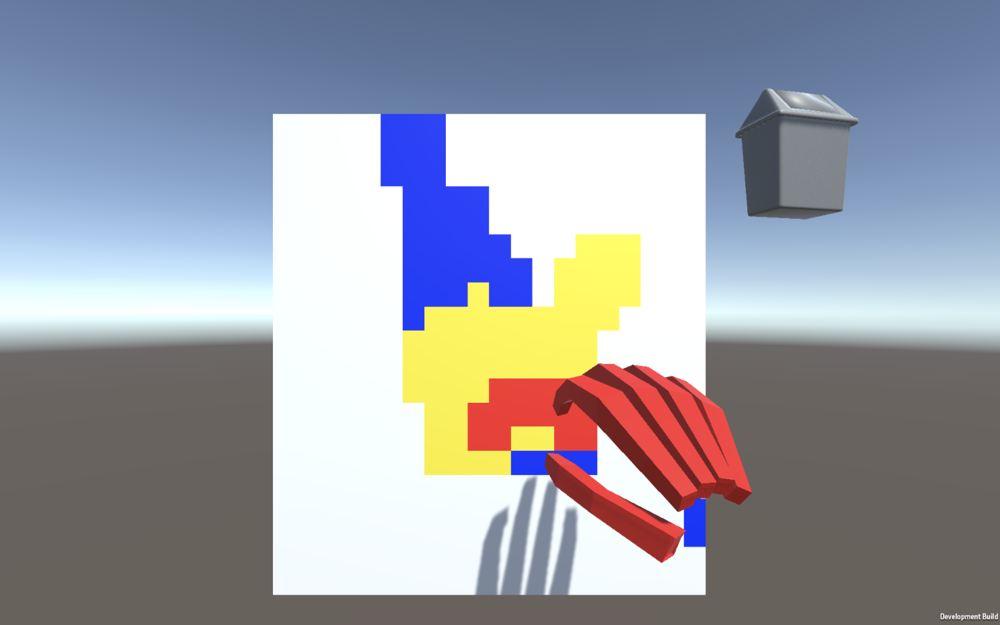
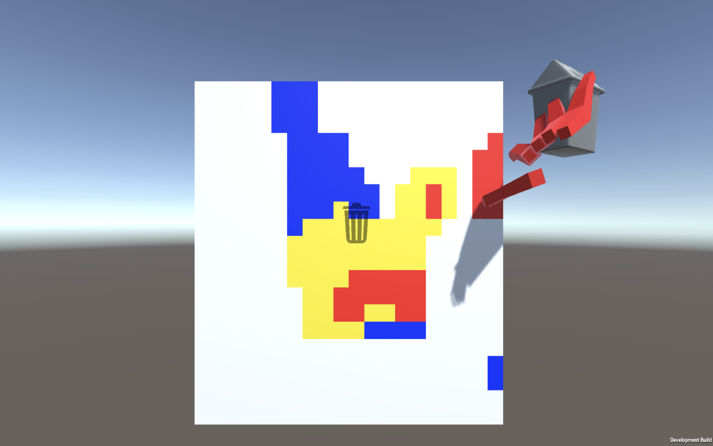
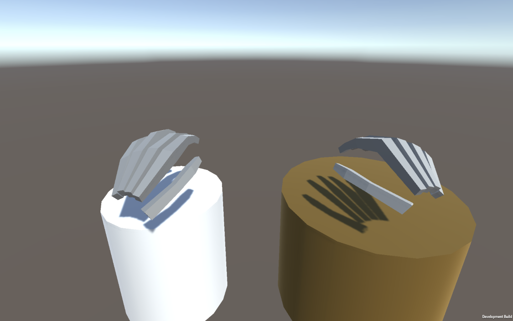

# Introducción e idea de museo 

**Musemium**

Musemium 2 es un museo de arte interactivo virtual que nos permite interactuar con diversas formas de arte de todo el mundo: desde obras clásicas como la Mona Lisa o El Grito hasta esculturas, música... 

Aún si viajamos por todo el mundo nuestra experiencia del arte está limitada por los museos tradicionales, en los que no podemos tocar u observar las esculturas y objetos que se encuentran en estos. A través de nuestras manos podremos, con la ayuda de Leap 

- Viajar por un mapamundi en el que explorar las distintas corrientes artísticas de cada región,
- coger y observar esculturas de distintos movimientos artísticos, manipularlas y rotarlas,
- crear nuestras propios cuadros con nuestras manos utilizando distintas herramientas e
- interactuar con instrumentos tradicionales que nos permitan ver distintas formas de música.

Combinado con la interfaz de voz y gestual esto nos da una experiencia completa del arte como la que podríamos disfrutar en un museo tradicional pero añadiendo nuevos elementos interactivos.

Las siguientes secciones describen con más detalle cada una de las experiencias disponibles.

\newpage

# El mapamundi

El medio de interacción principal con la aplicación es un mapa del mundo que podemos ampliar y mover mediante el uso de gestos con nuestras manos. Si ampliamos lo suficiente el mapa podremos visualizar distintos objetos (cápsulas) con los que interactuar.

Los gestos que podemos utilizar para movernos por el mapa son:

- [TODO no sé cuál es] para mover el mapa en el plano horizontal,
- [TODO no sé cuál es] para ampliar y reducir el mapa y
- mantener la mano en la región cercana a una cápsula para cargar la experiencia correspondiente a ese objeto.

Para indicar al usuario cómo interaccionar con las cápsulas se muestra una animación de carga cuando el usuario mantiene la mano en la región de la cápsula. Si el usuario la mantiene durante unos segundos puede acceder a dicha escena.

Además, la parte inferior de la pantalla muestra mediante un código de colores una descripción pictórica de la actividad correspondiente a cada cápsula como ayuda.

De esta forma podemos representar las distintas formas de arte en el mapa y permitir al usuario la exploración de las mismas en el orden que prefiera. Las ayudas visuales nos permiten que esta exploración sea natural e intuitiva.

# Interacción con las obras de arte

Musemium 2 consta de un modo de interacción con obras de arte de distintas corrientes en las que podemos manipular sus figuras en un recinto cerrado. Podremos coger, manipular y cambiar de figura mediante el uso de gestos naturales como:

- [TODO no sé cuál es] para cambiar la figura y
- coger la figura con las manos para observarla.

Para facilitar la interacción con las figuras hacemos que, inspirados por los ejemplos de Leap, al cerrar la mano esta actúe como un imán que atraiga al objeto para que sea más fácil de manipular.

# Creación de cuadros

Otra de las experiencias disponibles es el uso de nuestras manos para la creación de cuadros de arte pixelado.
En esta experiencia el usuario podrá utilizar su mano para apuntar a la zona que desea pintar y cambiar el tipo de color que esté utilizando en ese momento. En concreto los gestos que pueden utilizarse son:

- Colorear una zona del lienzo con el color de la mano actual moviendo la mano sobre la superficie,
- [TODO no sé cuál es] para cambiar el color de la herramienta y
- Mantener su mano en el cubo de basura para limpiar el lienzo.

Una animación inicial nos indica cómo interactuar con el lienzo.
Además, el color de la mano que aparece en pantalla indica el color con el cual se está pintando en ese momento.
Los colores disponibles son TODO.

Para limpiar el lienzo podemos mantener la mano sobre el cubo de basura.
Una animación nos indica que se borrará el lienzo y se reinicia la experiencia.
También podemos borrar cuando nuestra mano es de color blanco.

# Música

La última experiencia a la que podemos acceder por medio de Musemium 2 nos permite tocar música utilizando nuestras propias manos.

En esta experiencia podemos tocar con las palmas de las manos dos bongos que aparecen en escena, representando así una forma de arte que no habíamos cubierto en la práctica anterior. La experiencia está diseñada para representar cómo se toca realmente este instrumento, de tal manera que el gesto que puede utilizarse en esta escena es:

- colocar las palmas de las manos extendida y mirando hacia abajo haciendo contacto con cada uno de los bongos para tocarlos como si fueran instrumentos reales.

Una animación inicial nos indica cómo podemos tocar los bongos.

# Posible implementación de aspectos adicionales

En esta sección describimos la posible implementación de aspectos adicionales que no hemos implementado pero que podría complementar o ampliar las experiencias existentes en la práctica.

La interacción con las obras de arte podría constar de una ambientación temática a la figura que está siendo visualizada, que ayudaría a que la experiencia fuera más inmersiva. Para su implementación bastaría con el diseño y añadido de texturas adecuadas a la región que contiene a la figura que está siendo visualizada en ese momento.

Podríamos experimentar con nuevas herramientas para la pintura en el lienzo que nos permitan crear obras de arte con nuevas técnicas pictóricas. Para su implementación tendríamos que modificar el lienzo y aumentar el número de píxeles de los que consta.

Por último, podríamos experimentar con otro tipo de instrumentos que también puedan tocarse de forma adecuada con las manos.
